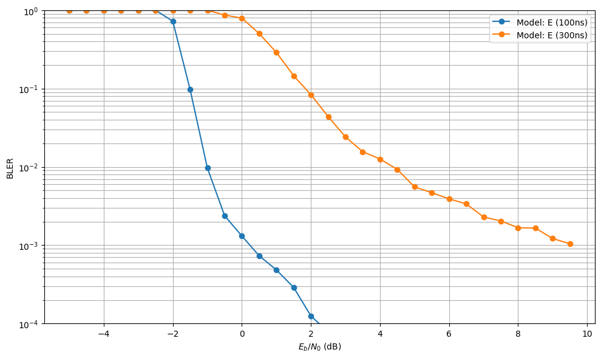
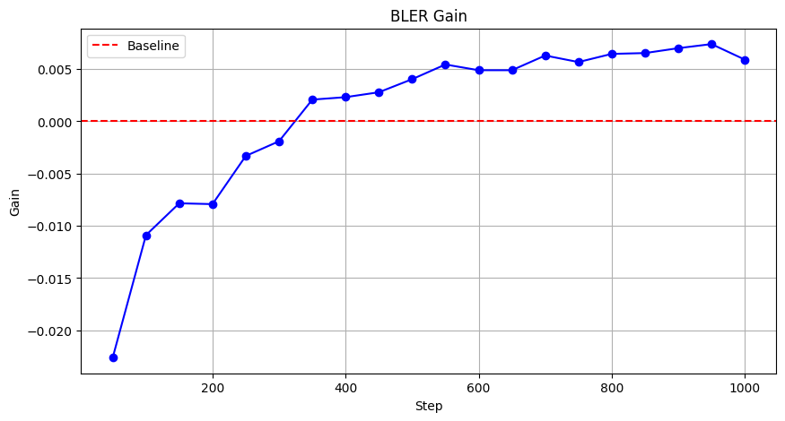

All details are in the notebook. Trained usable weights is in `neural_receiver_weights` and `neural_receiver_weights_pruned_dequantized_from_int8`.
The NRX model is based on [this tutorial](https://nvlabs.github.io/sionna/phy/tutorials/notebooks/Neural_Receiver.html) and [this paper](https://arxiv.org/abs/2005.01494)

Preview results are below

We observe the 2.5dB SNR gain at 10^-3 BLER between Neural Receiver and LS Estimation-based LMMSE receiver. However, the performance comparison between Neural Receiver and the LMMSE Receiver diverges as SNR increases. This shows that when the random noise power becomes less a limitation, the mathematical-grouded LMMSE equalizer performs better than the approximation-based Neural receiver.

The receiver generalizes almost perfectly across model C, D and E. It also performs slightly better on A-model. B-model is the only model that the receiver cannot generalize.

We can observe that across all standard 3GPP CDL channel models, the neural receiver maintains a maximum performance degradation of exactly 3.5 dB at a target BLER of $\approx 10^{-2}$.

To create a truly robust neural receiver, we can randomly feed the network with a randomized mix of difference channel models.

We can observe that the receiver performs much worse in high-delay spread just as in traditional receivers.

Initial results show a +0.0075 BLER  (~3x reduction in error rate) at 2.5dB after 1000 steps of domain adaptation. This serves as a proof-of-concept for the transfer learning approach.

A full SNR sweep can be implemented next to verify the gain across the entire waterfall curve.

Pruning and quantization do not appear to significantly degrade the BLER performance. The main observable impact is a relatively small loss of about 0.5 dB at a BLER of $10^{-3}$, which suggests that the compressed model still preserves most of the original performance. However, as stated above, this is a compression-error study, not a true INT8 inference benchmark.

