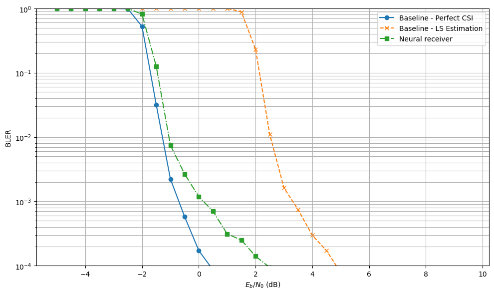
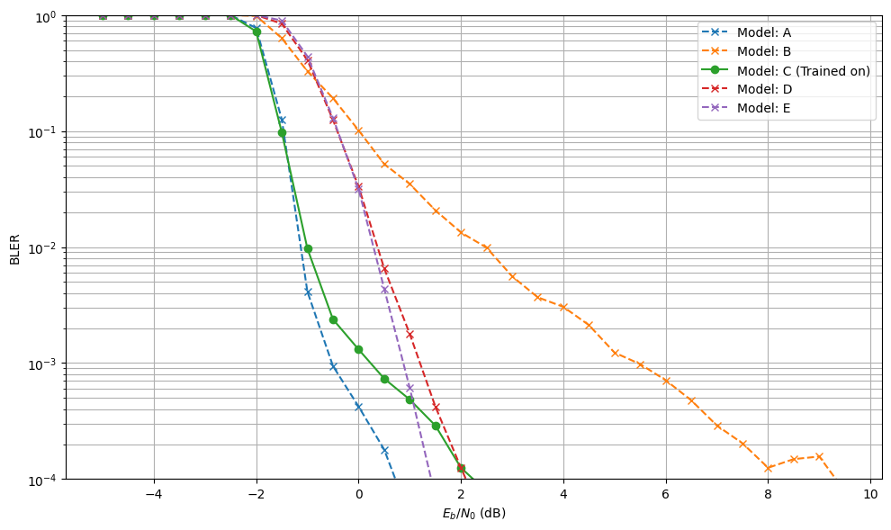
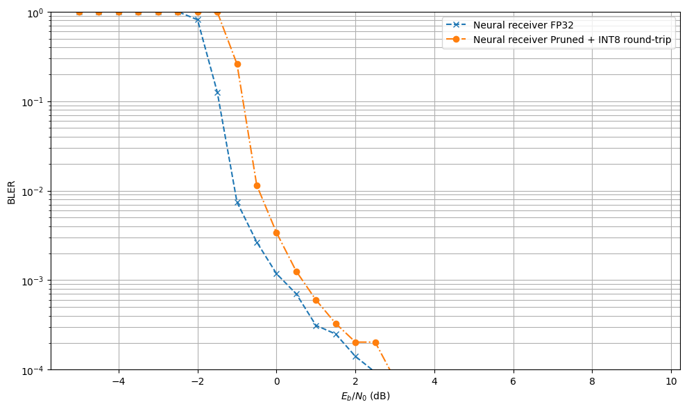

All details are in the notebook. Trained usable weights is in `neural_receiver_weights` and `neural_receiver_weights_pruned_dequantized_from_int8`.
The NRX model is based on [this tutorial](https://nvlabs.github.io/sionna/phy/tutorials/notebooks/Neural_Receiver.html). 

Preview results are below

